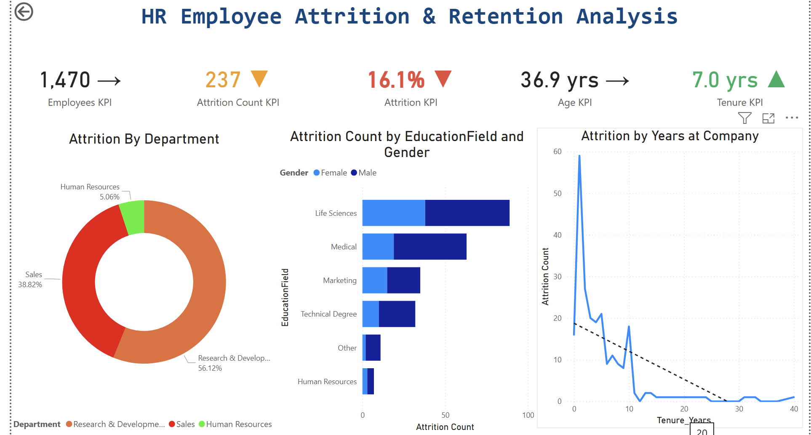
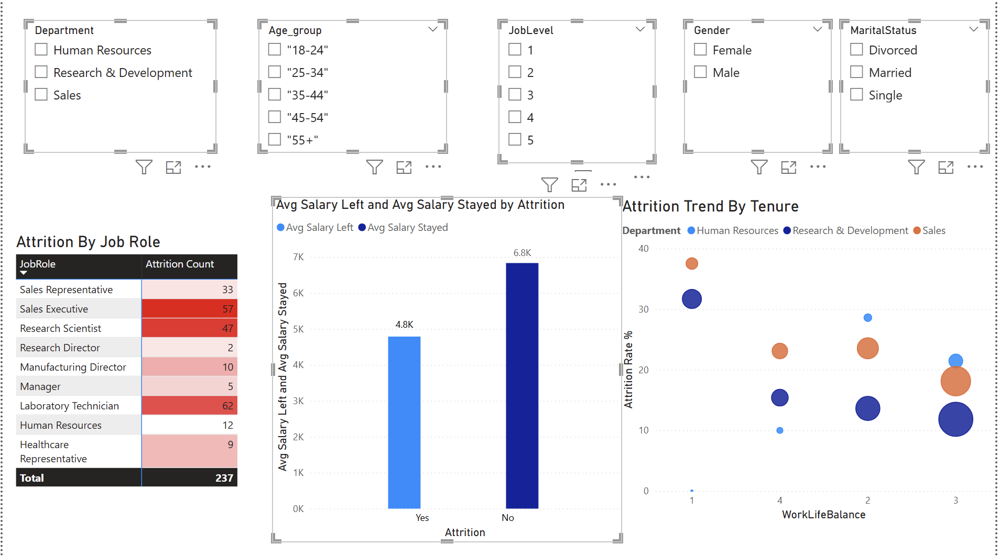
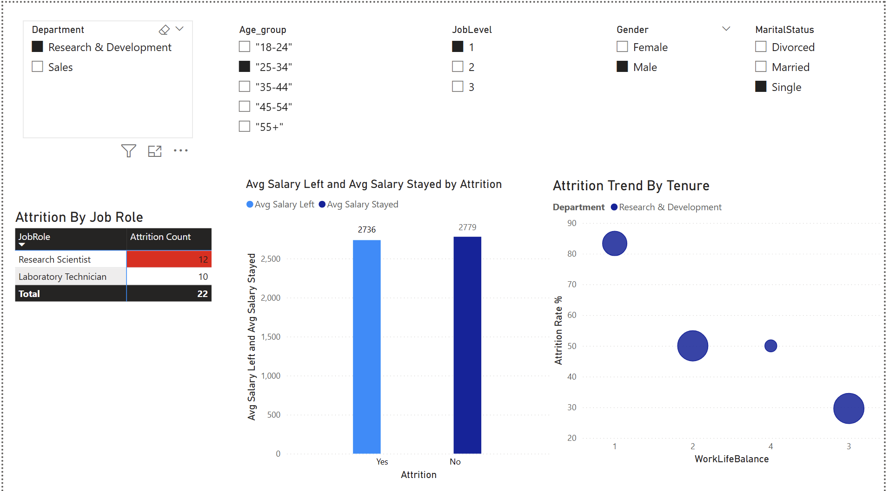
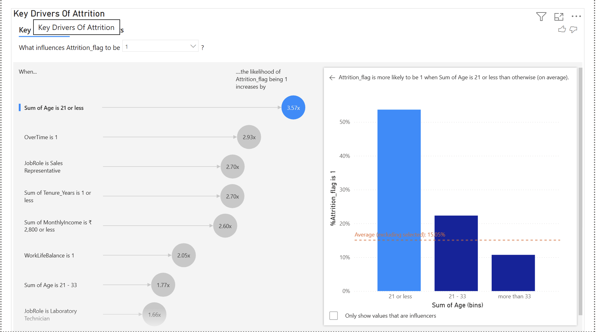

# HR Attrition Dashboard
Interactive Power BI dashboard analyzing HR employee attrition trends and insights.

# HR Attrition Dashboard Preview
1.Overview
2.Department Analysis
3.Employee Tenure
4.Key Influencers

## How to Use
1.Click [project_dashboard.pdf](https://github.com/user-attachments/files/26505932/project_dashboard.pdf)
 to view pdf document.
2. Open in Power BI Desktop.
3. Interact with slicers for department, tenure, etc.

## Key Insights
- Top attrition factors: Low satisfaction, high workload.
- Retention recommendations included.

## Technologies
- Power BI
- DAX measures
- Sample HR dataset
